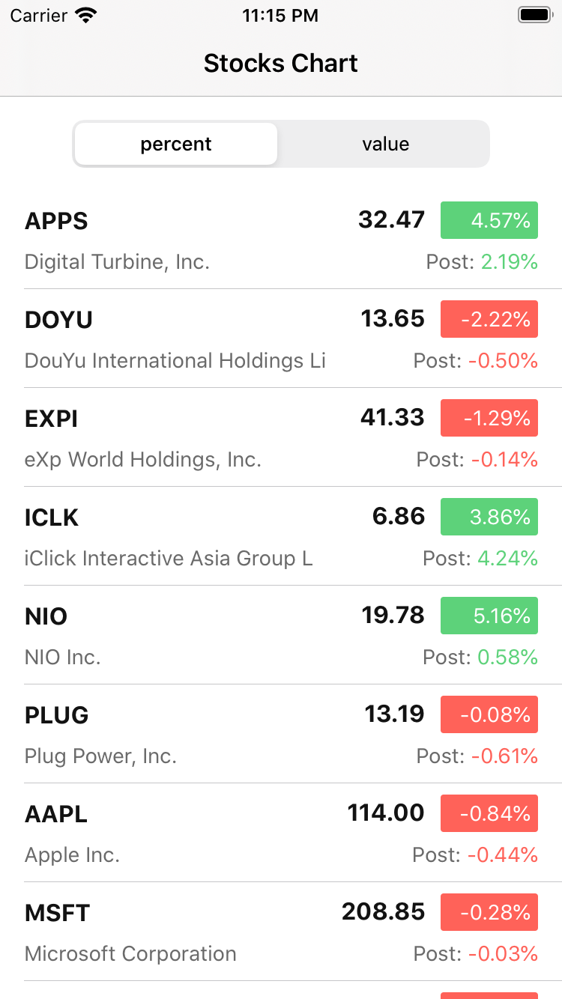

# Stocks Price
### Swift project with JSON parsing using codable coupled with Alamofire to show latest stock quotes.

## About the application
The app contains a a list of stock quotes which the user would need to see the price and change rates. 

## Usage
Xcode : 11.7
SDK: iOS 13.7
Cocoapods : Yes
Architecture: MVVM
3rd party libraries: 
1. Reusable - To be able to reuse XIB's. https://github.com/AliSoftware/Reusable 
2. SwiftLint - code quality check. https://github.com/realm/SwiftLint
3. MBProgressHUD - Simple progress loader. https://github.com/jdg/MBProgressHUD
4. Alamofire - Simplify network calls. https://github.com/Alamofire/Alamofire
5. OHHTTPStubs/Swift - Network stubbing and API mocking support. Much needed in case we dont have an API ket or net connection.

## Feature
1. Implement network call via Alamofire to fetch and parse json via codable.
2. Pull to refersh control.
3. Switch between Percentage change and value change view.
4. Unite test to cover the API calls.
5. Formatting of data coming form the API's
6. Support to be able to run offline.

## Assumptions
1. Assumes iOS 13 + iPhone Support ONLY. Not backwards comaptible.
2. Yahoo finace API were not available so used another provider, Rapid API which seem to provide the same feature. All links below.

## UP and Running

1. The project by default assumes running in offline mode with the help of saved JSON in bundle. To switch to online mode we will first need to get RAPID API keys.
2. Tutorial to get RAPID API keys. https://rapidapi.com/blog/how-to-use-the-yahoo-finance-api/
3. Once we have the RAPID API keys. Heade over to file SPAPIServices.swift and at line 14 update your real API key.
4. Select target > Edit Scheme > Run > Arguments > Environment Variables > Deslect Mock API. Now run the project to see live API call in action.
5. Use source control to download the latest source code upto date with most recent commits. 
6. Please run the project test suite from Xcode Menu > Product > Test to see the code coverage.

## TODO's

1. More unit tests for better code coverage.
2. Negative unit tests to check edge cases.

## Courtesy:
Padding label: https://github.com/levantAJ/PaddingLabel

### FinishedScreen

